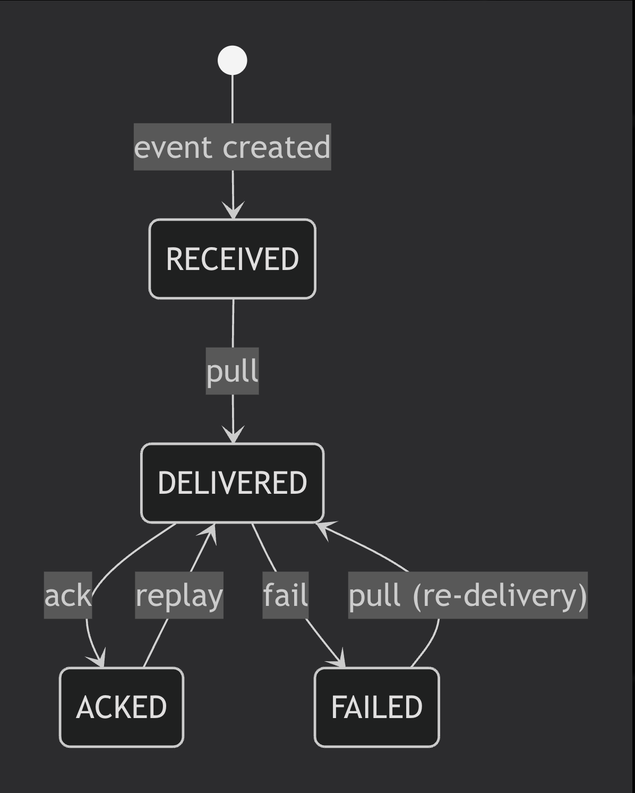

Here’s a simple state diagram and a summary table for your event state transitions.

## 📊 State Diagram 

## 📋 Transition Table

| From State | To State   | Trigger              | Description                                      |
|------------|------------|----------------------|--------------------------------------------------|
| RECEIVED   | DELIVERED  | `pull`               | Consumer pulls the event for processing.         |
| DELIVERED  | ACKED      | `ack`                | Consumer successfully processes and acknowledges.|
| DELIVERED  | FAILED     | `fail`               | Consumer reports a failure while processing.     |
| FAILED     | DELIVERED  | `pull`               | Consumer requests re‑delivery of a failed event. |
| ACKED      | DELIVERED  | `replay`             | Explicit replay moves an acked event back to delivered. |

## 🔁 Replay (Separate Operation)

- **From:** Any state (`RECEIVED`, `DELIVERED`, `ACKED`, `FAILED`)  
- **To:** A **new** event in `RECEIVED` state (original event unchanged)  
- **Description:** Creates a new delivery attempt of the event for reprocessing from scratch. The new event starts fresh in `RECEIVED`.
